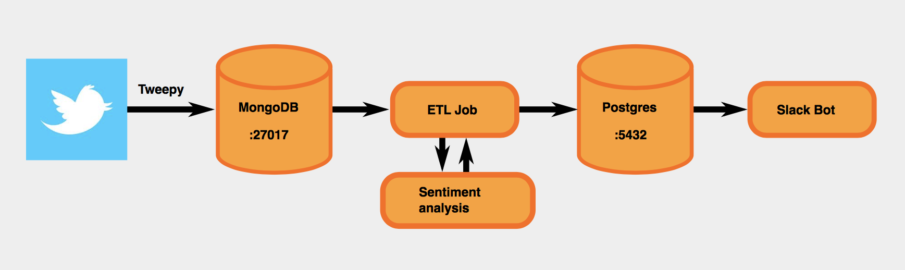
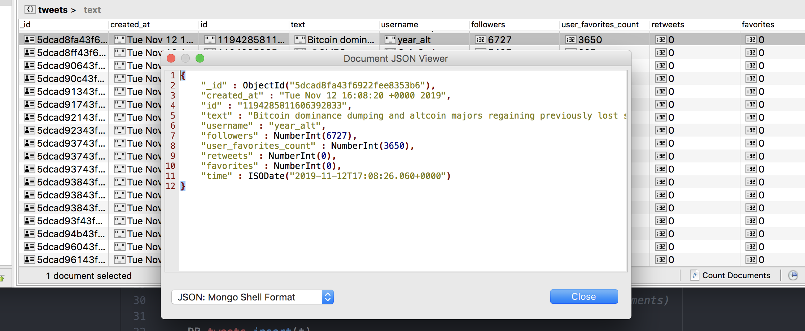
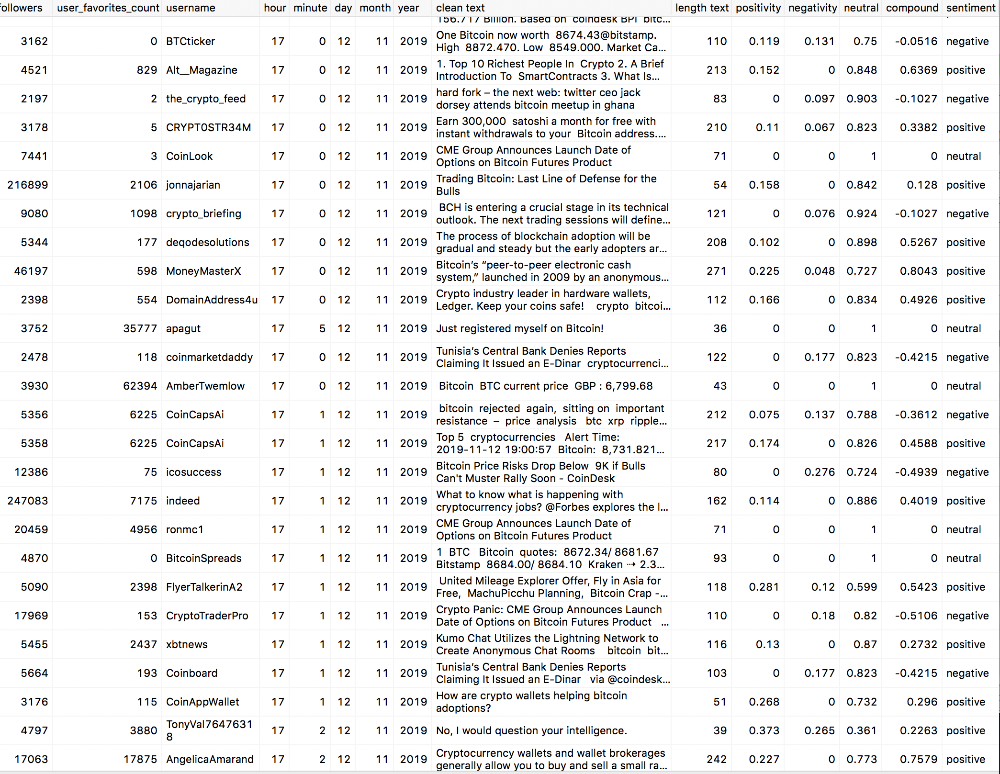
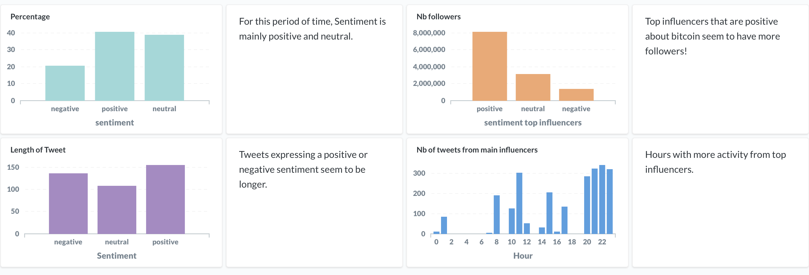

# Data-pipeline-twitter
---
>
>
## Introduction

This project aims at building a Dockerized Data Pipeline that analyzes the sentiment of tweets.
It consists into five components that are described in the diagram below.
The first component gets the twitter data for a particular topic as a continuous stream. The second
component stores the tweets in a Mongo database as json files. The third component is an ETL job
that cleans the text and computes some features such as sentiment analysis. The fourth component stores
this structured version of the tweets into a Postgres database. Finally, the last component is a slack bot
that will post a message summarizing the main sentiments every period of time. Each component will run in
a separate docker container, managed by docker-compose file (`docker-compose.yml`). You will
need [docker](https://www.docker.com) installed to run this pipeline.

 

## Get twitter data

The first component is within the folder `tweet_collector`.
Its main program is `get_tweets_for_mongo.py`. You will need to obtain
twitter credentials at [https://developer.twitter.com/en/apps](https://developer.twitter.com/en/apps),
register for an app and obtain the authentification tokens.
Place them in the `config.py` at :

```
cfg = {
    "CONSUMER_API_KEY"    : "...",
    "CONSUMER_API_SECRET" : "...",
    "ACCESS_TOKEN"        : "...",
    "ACCESS_TOKEN_SECRET" : "..."
    }

```
The program consists as an authentification with twitter api,
followed by an instantiation of Twitter StreamListener.

The current code is getting english tweets containing the word "bitcoin".
It can be easily changed for any topic by modifying:
`stream.filter(track=['bitcoin'], languages=['en'])`

Moreover, I chose to filter tweets that are not a retweet and where the user has more than 2000 followers (to only
get relevant information). This can be easily adapted. Then the data is stored in a Mongo DB.

## Mongo DB

The mongo database is running inside a docker container (built from docker mongo image),
and will receive a continuous stream of tweets. Data can be accessed as it is created (with a program
like Studio 3T for example, cf below) from the port 27021 (cf `docker-compose.yml`). It can be modified
to any unused port if needed.



## ETL

The third component is within the folder `etl_job`.
It consists in `scheduler.py`, `etl.py`, `etl_tools.py` and  `args.py`.
Currently, data is read every 20 minutes (it can be easily modified to any period of time)
`etl.py` is launched via `scheduler.py` passing
as argument the job number and the current index of Mongo database.
Data of Mongo database will be read from this index.

Then it will be transformed using functions from `etl_tools.py`. Mainly,
text of the tweet is cleaned using regex expression, a label for the length of the tweet
is created. Time of the tweet is put into features. Sentiment analysis is performed
using [vaderSentiment](https://github.com/cjhutto/vaderSentiment#about-the-scoring) library.
VADER (Valence Aware Dictionary and sEntiment Reasoner) is a lexicon and rule-based sentiment
analysis tool that is specifically attuned to sentiments expressed in social media.

I add to the tweet data a positivity score, a negativity score, a neutral score, a global score
as well as a text label between `neutral`, `positive` and `negative`.

Then it is saved into a Postgres database. Data can be accessed as it is created (with a program
like Postico for example, cf below) from the port 5554 (cf `docker-compose.yml`). It can be modified
to any unused port if needed.



## Slack Bot

The last component is within the folder `slack_bot` . To run it, you need to register
an app at [slack.api](https://api.slack.com) and get `Bot User OAuth Access Token`
that you would place into the token variable inside `slack_bot.py`.

It reads the last hour data of Postgres database every hour (it can be easily modified to any time period)
and compute the percentage of tweets being neutral, positive or negative, and post a message
into the slack channel where you registered your app.

## Metabase

Additionally, Postgres database can be accessed via Metabase to perform queries, analyzes and display
as the data is being created. Below, I show a simple example of a dashboard with some tweets about bictoin
over one day. Ideally, data should be accumulated over a long period of time in order to be able to use it to
analyze possible trends or add it as an extra feature for a predictive modelling.



## How to use?

```
Clone this repository
Add twitter authentification tokens in config.py file
Add slack authentification token in slack_bot.py file
Modify get_tweets_for_mongo.py for the word you are interested in
```

## License

[](http://badges.mit-license.org)

- **[MIT license](http://opensource.org/licenses/mit-license.php)**
